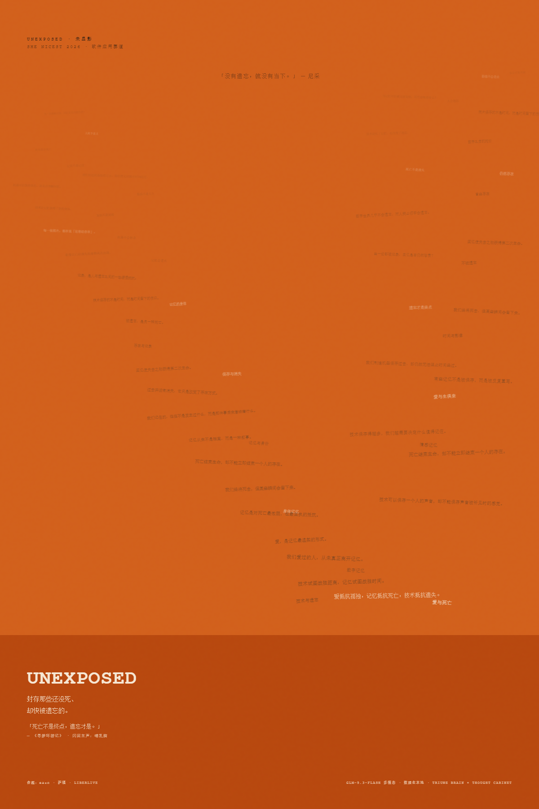

# Unexposed / 未显影

> **把照片封存成胶卷，让今天的解释在未来重新显影。**

Unexposed 是一款本地优先的个人影像记忆应用。它不鼓励用户无限囤积照片，而是要求每卷只选择 **3 张**，为它们留下当下的说明并完成一次有仪式感的封存。未来再次打开胶卷时，用户可以重新回答“它现在对我意味着什么”，让同一张照片保留多个时间版本；也可以进入 AI“闪回”对话，从照片、旧说明和用户的叙述中继续追问，最终把有价值的内容写回照片。



## 参赛提交信息

- **赛道及命题：** 软件应用赛道：滴水穿石
- **作品名称：** Unexposed / 未显影
- **作品 Slogan：** 把照片封存成胶卷，让今天的解释在未来重新显影。
- **作品形态：** 可运行的 Next.js Web 应用，桌面端优先，兼顾移动端与键盘操作
- **GitHub Topic：** `shenicest-fission`（仓库发布后需在 GitHub 仓库设置中添加；Topic 本身不带 `#`）
- **代码仓库：** 待创建或关联 GitHub 仓库。当前目录未检测到 Git 元数据，提交前必须补充公开或评审可访问的仓库链接。
- **演示视频：** 已有脚本与可播放的网页分镜，正式视频文件及公开视频链接待录制后补充。
- **在线体验：** 可选，部署后补充 URL。未配置云端 AI 时，建议在演示设备上运行本地 Ollama。

建议提交时将本节原样复制到报名表，再用真实链接和团队信息替换“待补充”项。

## 作品描述

手机让拍照几乎没有成本，却让“为什么留下这张照片”越来越容易丢失。相册擅长按时间、地点和人物整理已经拍到的内容，却很少保存拍摄者当时的选择、解释和后来发生的变化。

Unexposed 用胶卷隐喻把记忆产品变成一条克制的闭环：创建一卷胶卷，挑选恰好三张照片，为每张照片写下或说出当下的解释，确认后封存；之后再通过“重新显影”和“闪回对话”添加新版本。原始记录不被覆盖，新的理解以时间层叠加，从而保留“那时”和“现在”的差异。

产品当前已经实现可运行、可体验的原型，而不是仅有界面展示：照片、说明、胶卷版本、反思和对话均可保存在当前浏览器；核心封存流程不依赖 AI，模型不可用时仍可创建、查看和重新显影胶卷。

## 目标用户与真实场景

- 照片很多、但很少回看或整理的人，希望用低频、低负担的方式留下真正重要的片段。
- 经常担任拍摄者、自己反而很少出现在画面中的家庭记录者。
- 希望保存父母、伴侣或朋友口述记忆的人，但不希望家人学习复杂的数字档案工具。
- 想观察同一段经历在多年后如何被重新理解的人。

典型使用场景：用户从一次旅行或一段关系中选择三张照片，写下当时的理由并封存；数月后再次打开，回答系统提出的问题，形成并列的 Then / Now 记录，而不是用今天的说法覆盖过去。

## 核心体验

1. **创建胶卷**：填写标题并选择主题，系统持续保存草稿。
2. **Exactly 3**：拖入或选择图片，只保留三张，可替换、删除和调整顺序。
3. **留下语境**：为每张照片添加文字说明；浏览器支持时也可录音。
4. **Seal the Roll**：预览并确认封存。照片、说明和创建时间成为不可覆盖的历史版本。
5. **胶卷桌面**：以可交互胶卷罐浏览已封存内容；设备能力不足时自动使用轻量 2D 版本。
6. **重新显影**：为旧照片写下今天的解释，生成新的 Double Exposure 记录，并与旧版本并列。
7. **AI 闪回**：模型先理解照片，再结合本地检索语料和多角色“内心声音”展开流式对话；用户可以封存完整对话，并将提炼结果追加到照片说明。
8. **本地对话档案**：按照片查看已封存的历史对话。

## 核心创新点

### 1. 用“选择”替代“囤积”

每卷恰好三张照片不是容量限制，而是产品机制。它迫使用户明确本次真正想保存什么，使归档本身成为一次有意义的决策。

### 2. 记忆可修订，历史不被无摩擦覆盖

封存后的原始说明保留不变，未来的理解以新版本追加。Double Exposure 把认知变化变成可见的产品对象，让用户看到自己如何重新解释同一段经历。

### 3. AI 不是替用户写回忆，而是协助追问

AI 负责读图、召回相关表达、组织追问和提炼对话；用户决定事实与意义。模型失败不会阻塞非 AI 主流程，封存、浏览和手动重新显影仍然可用。

### 4. Local-first 与可切换推理

照片和核心记录默认写入浏览器 IndexedDB。AI 可使用本机 Ollama，也可通过环境变量切换到兼容 OpenAI Chat Completions 的服务，便于在隐私、性能和演示稳定性之间做选择。

## 技术栈与架构

- **应用框架：** Next.js 16 App Router、React 19、TypeScript
- **样式与交互：** Tailwind CSS 4、Framer Motion
- **空间与物理：** Three.js、React Three Fiber、Drei、Matter.js
- **本地数据：** Dexie + IndexedDB
- **AI：** OpenAI 兼容 Chat Completions 接口；默认本地 Ollama，可选云端兼容服务
- **本地模型默认值：** `qwen2.5:7b`（对话）、`qwen2.5vl:7b`（视觉）、`bge-m3`（检索向量）
- **输入能力：** File API、MediaRecorder、浏览器 SpeechRecognition（按浏览器支持情况启用）

```text
浏览器
├─ 胶卷创建 / 桌面 / 重新显影 / 对话档案
├─ IndexedDB：照片、胶卷版本、反思、对话、AI 缓存
└─ Next.js Route Handlers
   ├─ 对话、开场、审议、总结、图片描述
   ├─ 本地 Ollama（默认，可离线）
   └─ OpenAI 兼容云端服务（可选）
```

AI 相关接口位于 `app/api/flashback/`。对话采用流式响应；读图结果、开场文本和对话记录会在本地缓存。公开提交目录使用空检索索引，不包含授权尚未确认的研究语料；索引或 embedding 模型不可用时会降级，不阻塞基础体验。

## 数据安全与隐私说明

- 胶卷、照片 Blob、说明、版本和对话默认保存在当前浏览器的 IndexedDB，不会因为使用核心功能而自动上传到业务服务器。
- 使用本地 Ollama 时，AI 请求发送到本机配置的 Ollama 地址。使用云端兼容服务时，为完成读图或对话，相关照片内容、说明和对话上下文会发送给所配置的第三方模型服务。
- API Key 仅从服务端环境变量读取，不应提交到仓库；`.env.local` 已列入忽略规则。
- 清除浏览器站点数据、无痕窗口关闭、浏览器重装或设备损坏都可能导致本地记录丢失。目前尚未实现导入、导出、加密备份和跨设备同步。
- 录音和语音识别能力受浏览器权限及实现影响。演示前应确认权限；不要使用包含未授权人物、隐私信息或敏感内容的照片。
- 当前项目面向产品原型验证，不应宣称具备医疗、心理治疗、数字遗产托管或长期备份能力。

## 本地运行

### 环境要求

- Node.js 20.9 或更高版本
- pnpm
- 现代浏览器：Chrome / Edge 111+、Firefox 111+ 或 Safari 16.4+

### 仅体验核心流程

```bash
pnpm install
pnpm dev
```

打开 <http://localhost:3000>。不配置模型也可以创建胶卷、保存照片、查看封存内容和手动重新显影；AI 闪回相关功能会提示模型不可用。

### 启用本地 AI（推荐用于隐私演示）

安装并启动 Ollama，然后准备模型：

```bash
ollama pull qwen2.5:7b
ollama pull qwen2.5vl:7b
ollama pull bge-m3
```

默认连接 `http://localhost:11434`。如需覆盖，可在 `.env.local` 中设置：

```dotenv
OLLAMA_HOST=http://localhost:11434
GENERATION_MODEL=qwen2.5:7b
VISION_MODEL=qwen2.5vl:7b
EMBED_MODEL=bge-m3
RAG_TOP_K=3
```

这些变量已有代码默认值，因此无需为了默认配置创建环境文件。

### 切换到云端兼容服务

复制 `.env.local.example` 为 `.env.local`，填写以下变量：

```dotenv
LLM_API_KEY=your_api_key
LLM_BASE_URL=https://your-provider.example/v1
LLM_CHAT_MODEL=your_multimodal_model
```

只要设置 `LLM_API_KEY`，文本对话和图片描述就会改用该服务；向量检索仍默认依赖本地 Ollama 的 `bge-m3`，不可用时自动降级。请确认所选模型支持项目使用的 OpenAI 兼容消息格式与图片输入格式。

### 构建与生产运行

```bash
pnpm build
pnpm start
```

本次整理已在 Windows 环境使用 Next.js 16.3.2 完成生产构建，TypeScript 检查、静态页面生成和全部 Route Handler 编译均通过。

## 演示建议

推荐控制在 3 分钟，并始终保留“无 AI 也能完成核心闭环”的备用路线。

1. **0:00–0:25，问题**：照片越来越多，但当时为什么留下它正在消失。
2. **0:25–1:15，Exactly 3**：创建胶卷、选择三张照片、补充说明。
3. **1:15–1:40，封存**：展示 Seal 仪式与胶卷回到桌面的瞬间。
4. **1:40–2:15，重新显影**：打开旧胶卷，新增今天的解释，展示 Then / Now。
5. **2:15–2:45，AI 闪回**：展示读图、追问、流式对话和封存摘要。
6. **2:45–3:00，价值与隐私**：强调用户定义意义、本地优先、AI 可替换且失败不阻塞。

现有演示材料：

- [`deliverables/unexposed-demo-script-v1.md`](./deliverables/unexposed-demo-script-v1.md)：演示口播脚本
- [`demo-video.html`](./demo-video.html)：视频分镜网页，可用于录屏或剪辑参考
- [`demo-deck.html`](./demo-deck.html)：路演页
- [`poster-mind.png`](./poster-mind.png)：项目主视觉，可作为报名项目图片
- [`deliverables/unexposed-roadshow-poster-preview.png`](./deliverables/unexposed-roadshow-poster-preview.png)：路演海报预览

正式提交前请输出 MP4 或上传至稳定的视频平台，并在“参赛提交信息”中补充链接。仅提交 `demo-video.html` 不能等同于作品演示视频。

## 项目目录

```text
app/                 页面、布局与 AI Route Handlers
components/          开场、桌面、胶卷流程、闪回、音效和通用界面
lib/                 IndexedDB、AI Provider、检索、类型与工具
data/                可选检索索引；公开提交版不包含未确认授权的语料
example/             本地演示图片
deliverables/        演示脚本与海报素材
scripts/             视觉概念辅助脚本
*.html               早期视觉概念、海报、路演和视频分镜
*.docx / *.pdf       产品规格、Hackathon 手册与研究参考
delete/              已退出主流程的旧实现，仅供追溯，不参与构建
```

## 开发过程

1. 从“照片很多，但意义与语境正在消失”这一具体问题出发，形成“每卷恰好三张”的克制规则。
2. 先用多份 HTML 概念稿验证胶卷、暗房、桌面和海报视觉语言，再迁移到正式 Next.js 应用。
3. 建立 Dexie 数据模型，实现草稿持续保存、封存版本、照片反思和对话归档。
4. 加入 3D 胶卷桌面、物理效果和渐进降级，确保低性能设备仍有可用入口。
5. 抽象 AI Provider，同时支持本地 Ollama 与云端 OpenAI 兼容接口；加入读图、检索、流式对话、多角色审议和摘要写回。
6. 增加中英双语、键盘返回、降低动态效果、语音输入及错误降级。
7. 整理路演海报、三分钟演示脚本和视频分镜，并完成生产构建与关键页面试运行。

## 团队分工

当前仓库没有可靠的参赛者姓名与角色信息，不能代为虚构。报名提交前请补充以下内容；个人参赛可将各项均填写为本人：

- 产品与用户研究：`待补充`
- 视觉与交互设计：`待补充`
- 前端与数据层：`待补充`
- AI 与检索：`待补充`
- 测试、路演与视频：`待补充`

团队人数须不超过 5 人。

## 已知限制与可完善项

### 提交前必须完成

- [ ] 初始化或关联 Git 仓库，推送到 GitHub，并添加 Topic `shenicest-fission`。
- [ ] 补充真实团队成员、分工、仓库 URL、演示视频 URL；如已部署，再补充体验链接。
- [ ] 使用全新浏览器配置完整走通三次：首次进入 → 新建胶卷 → 上传三图 → 说明 → 封存 → 重开 → 重新显影 → 闪回。
- [ ] 准备一套不含个人隐私、授权清晰、可离线使用的演示照片与预置数据。
- [ ] 对内置研究文本、PDF、字体、图片和 AIGC 素材逐项确认授权。尤其是《极乐迪斯科》文本及其派生索引不应在授权不明时随公开仓库发布；可改用自有或许可明确的语料。
- [ ] 检查公开仓库历史，确保 `.env.local`、API Key、个人照片和本地数据库从未被提交。

### 产品与工程改进

- [ ] 增加数据导出、导入、完整删除、备份恢复与可选加密，降低浏览器数据丢失风险。
- [ ] 在切换云端 AI 前增加明确的逐次或范围化授权提示，说明会发送哪些照片与文本、发送到哪里。
- [ ] 增加图片尺寸、格式、容量限制以及压缩流程，避免大图导致 IndexedDB 配额不足或内存峰值。
- [ ] 为模型超时、断网、浏览器拒绝麦克风权限、IndexedDB 配额耗尽和不支持 WebGL 的设备补充自动化测试。
- [ ] 增加单元测试、端到端测试、无障碍审计与独立 lint/format 脚本；当前 `package.json` 只有 dev/build/start。
- [ ] 补充 CSP、安全响应头、上传内容校验、API 请求大小限制和速率限制，再进行公网部署。
- [ ] 将 AI 配置示例补齐本地 Ollama 变量，并在界面中显示当前是“本地”还是“云端”推理。
- [ ] 增加用户可见的存储空间、导出状态、模型状态和故障恢复提示。
- [ ] 完善移动端触控、Safari 语音兼容、低端设备性能和 `prefers-reduced-motion` 回归测试。
- [ ] 清理或迁移早期概念稿、研究 PDF、生成脚本和 `delete/` 目录，使最终公开仓库更小、更清楚。
- [ ] 增加正式开源许可证、素材许可证清单、贡献说明和版本变更记录。

## 验收记录

整理日期：2026-08-29。

- `pnpm build`：通过。Next.js 16.3.2 使用 Turbopack 完成生产编译、TypeScript 检查、10 个页面/接口入口的数据收集与静态页面生成。
- 本地开发服务：可启动；检测到本目录已有一个运行中的 Next.js 开发服务并直接复用。
- 浏览器试运行：首页成功加载，开场可跳过；胶卷桌面读取到已保存胶卷；点击胶卷可进入 `/roll/[id]`，三张曝光位、说明、日期与重新显影入口可见；控制台未发现页面级错误。
- 未在本次验收中向云端模型发送照片或对话，也未改动现有浏览器中的个人胶卷数据。
- 未完成项：全新的上传—封存闭环会写入浏览器本地数据，未为避免污染现有数据而重复创建；AI 质量取决于本机 Ollama 或用户配置的兼容服务，未作为生产构建通过的必要条件。

## 提交检查清单

- [x] 选择的赛道及命题
- [x] 作品名称
- [x] 作品 Slogan
- [x] 作品描述
- [x] 项目图片（仓库内已有可用主视觉与路演海报）
- [ ] GitHub 代码仓库及 Topic `shenicest-fission`
- [x] 项目文档（背景、目标用户、技术栈、创新点、开发过程、后续计划）
- [ ] 正式作品演示视频与链接
- [ ] 可直接体验项目的链接（可选）
- [ ] 团队成员与真实分工

---

**一句话总结：** Unexposed 不替用户记住一切，而是帮助用户认真选择什么值得留下，并允许这份意义随时间重新显影。
